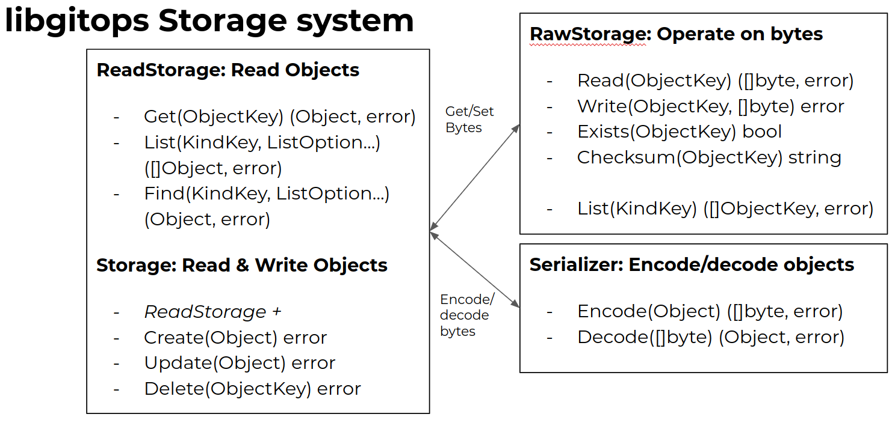
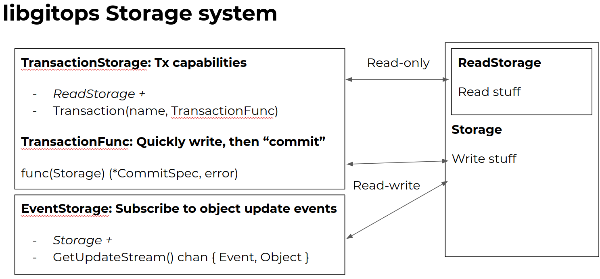

# Weave libgitops

A library of tools for manipulation and storage of Kubernetes-style objects with inbuilt GitOps functionality.
Weave `libgitops` builds on top of the [Kubernetes API Machinery](https://github.com/kubernetes/apimachinery).

The library consists of several components, including (but not limited to):

## YAML/JSON Serializer - `pkg/serializer`

The libgitops `Serializer` is a powerful extension of the Kubernetes API Machinery serialization/manifest manipulation tools.

It operates on Kubernetes `runtime.Object` compliant objects (types that implement `metav1.TypeMeta`), and focuses
on streamlining the user experience of dealing with encoding/decoding, versioning (GVKs), conversions and 
defaulting.

It also supports API types built with [controller-runtime](https://pkg.go.dev/sigs.k8s.io/controller-runtime/?tab=doc).

**Feature highlight:**

- Preserving of Comments (even through conversions)
- Strict Decoding
- Multi-Frame Support (multiple documents in one file)
- Works with all Kubernetes-like objects

**Example usage:**

```go
// Create a serializer instance for Kubernetes types
s := serializer.NewSerializer(scheme.Scheme, nil)

// Read all YAML documents, frame by frame, from STDIN
fr := serializer.NewYAMLFrameReader(os.Stdin)

// Decode all YAML documents from the FrameReader to objects
objs, err := s.Decoder().DecodeAll(fr)

// Write YAML documents, frame by frame, to STDOUT
fw := serializer.NewYAMLFrameWriter(os.Stdout)

// Encode all objects as YAML documents, into the FrameWriter
err = s.Encoder().Encode(fw, objs...)
```

See the [`pkg/serializer`](pkg/serializer) package for details.

**Note:** If you need to manipulate unstructured objects (not struct-backed, not `runtime.Object` compliant), the
[kyaml](https://pkg.go.dev/sigs.k8s.io/kustomize/kyaml@v0.6.0/yaml?tab=doc) library from kustomize may be a better fit.

## The extended `runtime` - `pkg/runtime`

The [`pkg/runtime`](pkg/runtime) package provides additional definitions and helpers around the upstream API Machinery
runtime. The most notable definition is the extended `runtime.Object` (from herein `pkg/runtime.Object`):

```go
// Object is an union of the Object interfaces that are accessible for a
// type that embeds both metav1.TypeMeta and metav1.ObjectMeta.
type Object interface {
    runtime.Object
    metav1.ObjectMetaAccessor
    metav1.Object
}
```

Any struct that embeds both `metav1.TypeMeta` and `metav1.ObjectMeta` inline, and has the automatically-generated
deep-copy code using the tag `// +k8s:deepcopy-gen:interfaces=k8s.io/apimachinery/pkg/runtime.Object` will implement
`pkg/runtime.Object`. See an example in [cmd/sample-app/apis/sample](cmd/sample-app/apis/sample).

This extended `pkg/runtime.Object` is used heavily in the storage subsystem described below.

## The storage system - `pkg/storage`

The storage system is a collection of interfaces and reference implementations for storing Kubernetes-like objects
(that comply to the extended `pkg/runtime.Object` described above). It can be thought of as a database abstraction layer
for objects based on how the interfaces are laid out.

There are three "layers" of storages:

### RawStorage interface

The `RawStorage` interfaces deal with _bytes_, this includes `RawStorage` and `MappedRawStorage`. It is essentially a
filesystem abstraction.

- `GenericRawStorage` is a generic implementation of `RawStorage`, storing all objects as files on disk using the
  following path pattern: `<top-level-dir>/<kind>/<identifier>/metadata.json`.
- `GenericMappedRawStorage` is a generic implementation of `MappedRawStorage`, keeping track of mappings between
  `ObjectKey`s and the real file path on disk. This might be used for e.g. a Git repository where the file structure
  and contents don't follow a specific format, but mappings need to be registered separately.

### Storage interfaces

"Generic" `Storage` interfaces deal with _objects_, this includes `Storage`, `TransactionStorage` and `EventStorage`.

- The `Storage` interface is a union of two smaller interfaces, `ReadStorage` and `WriteStorage`. It exposes CRUD
  operations like `Get`, `List`, `Create`, `Update`, `Delete`.
- `TransactionStorage` extends `ReadStorage` with a `Transaction` method, which temporarily gives access to also the
  `WriteStorage` part when the transaction is active.
- `EventStorage` allows the user to subscribe to object events arising from changes by other actors in the system, e.g.
  a new object was added, or that someone changed or deleted some other object.

### Storage implementations

"High-level" `Storage` implementations bind together multiple `Storage`s, this includes `GenericWatchStorage`,
`GitStorage` and `ManifestStorage`.

- `GenericStorage` is a generic implementation of `Storage`, using the given `RawStorage` and `Serializer` to provide
  object operations to the user.
- `GenericWatchStorage` is an implementation of `EventStorage`, using inotify to watch a directory on disk. It sends
  update events to a registered channel. It is a superset of and extends a given `Storage`.
- `GitStorage` takes in a `GitDirectory` a `PullRequestProvider` and a `Serializer`. It watches for new commits
  automatically pulled by the `GitDirectory`, and re-syncs the underlying `GenericMappedRawStorage`. It implements
  the `TransactionStorage` interface, and when the transaction is active, allows writing which then yields a new branch
  and commit, pushed to the origin. Lastly, it can, using the `PullRequestProvider` create a Pull Request for the
  branch. In the future, it should also implement `EventStorage`.
- `ManifestStorage` watches a directory on disk using `GenericWatchStorage`, uses a `GenericStorage` for object
  operations, and a `GenericMappedRawStorage` for files. Using it, implementing `EventStorage`, you can subscribe to 
  file update/create/delete events in a given directory, e.g. a cloned Git repository or "manifest directory".

**Example on how the storages interact:**





See the [`pkg/storage`](pkg/storage) package for details.

### The filtering framework - `pkg/filter`

The filtering framework provides interfaces for `pkg/runtime.Object` filters and provides some basic filter
implementations. These are used in conjunction with storages when running `Storage.Find` and `Storage.List` calls.

There are two interfaces:

- `ListFilter` describes a filter implementation that filters out objects from a given list, like a UNIX pipe.
- `ObjectFilter` describes a filter implementation returning a boolean for if a single given object is a match.

There is an `ObjectToListFilter` helper provided for easily creating `ListFilter`s out of simpler `ObjectFilter`s.

See the [`pkg/filter`](pkg/filter) package for details.

### The GitDirectory - `pkg/gitdir`

The `GitDirectory` is an abstraction layer for a temporary Git clone. It pulls and checks out new changes periodically
in the background. It allows high-level access to write operations like creating a new branch, committing, and pushing.

It is currently utilizing some functionality from [go-git-providers](https://github.com/fluxcd/go-git-providers/), but
should be refactored to utilize it more thoroughly. See
[weaveworks/libgitops#38](https://github.com/weaveworks/libgitops/issues/38) for more details regarding the integration.

See the [`pkg/gitdir`](pkg/gitdir) package for details.

### Utilities - `pkg/util`

This package contains utilities used by the rest of the library. The most interesting thing here is the `Patcher`
under [`pkg/util/patch`](pkg/util/patch), which can be used to apply patches to `pkg/runtime.Object` compliant types.

## Sample implementations

All sample binaries in this repo are operating on a sample type called `Car`, that looks something like this:

```yaml
apiVersion: sample-app.weave.works/v1alpha1
kind: Car
metadata:
  creationTimestamp: "2020-08-17T14:33:16Z"
  name: foo
  namespace: default
spec:
  brand: SAAB
  engine: The best one
  yearModel: "2008"
status:
  acceleration: 0
  distance: 12176941420362965433
  persons: 0
  speed: 53.37474583162469
```

All binaries lets you access the data and fake a modification event using a sample webserver running on `localhost:8888`.

### sample-gitops

This is a sample binary that:

a) clones a Git repo of your choice to a temporary directory, and authenticates using given `id_rsa` and `known_hosts` files. Create a Git repo with e.g. the sample file above, and set up SSH connection.
b) exposes all `Car`s in your Git repository at URL `GET localhost:8888/git/`
c) lets you fake a "reconciler spec/status write" event at path `PUT localhost:8888/git/<name>`, where `name` is the name of the `Car` in your repo you want to modify
d) re-syncs every 10 seconds, and tries to pull the git repo
e) has an inotify watch on the temporary Git clone, so it will log all objects that have been changed as they happen in Git (e.g. from new commits)

When you modify a the "desired state/current status" using e.g. `curl -sSL -X PUT localhost:8888/git/foo`, the following will happen:

a) a `Transaction` will be started, which means `git pull` and `git checkout -b <name>-update-<random>` will happen underneath
b) `Storage.Get` for the `Car` with the given name will be requested
c) the Car's `.status.distance` and `.status.speed` fields are updated to random numbers, and `Storage.Update` is run
d) the transaction is "committed" by returning a `transaction.PullRequestResult`
e) when the transaction ends, `git commit -A -m <message>`, `git push` and `git checkout <main>` will be ran. The `git pull` loop is resumed.
f) as a `transaction.PullRequestResult` was returned (and not `transaction.CommitResult`), the code will also use a `transaction.PullRequestProvider` to create a PR towards the repo. The configured provider is for now Github-only, and configured through the `GITHUB_TOKEN` variable.
g) the PR will be created for the given branch, with assignees, labels and a milestone as configured
h) once the PR is merged, the `git pull` loop will eventually download the new commit, and the inotify watch will tell which files were changed.

#### sample-gitops Usage

```console
$ make
...
$ bin/sample-gitops --help
Usage of bin/sample-gitops:
    --author-email string    Author email for Git commits (default "support@weave.works")
    --author-name string     Author name for Git commits (default "Weave libgitops")
    --git-url string         HTTPS Git URL; where the Git repository is, e.g. https://github.com/luxas/ignite-gitops
    --identity-file string   Path to where the SSH private key is
    --pr-assignees strings   What user logins to assign for the created PR. The user must have pull access to the repo.
    --pr-milestone string    What milestone to tag the PR with
    --version                Show version information and exit
```

You also need to set `GITHUB_TOKEN` in order to be able to create the PR.

### sample-watch

sample-watch demonstrates use of the inotify `GenericWatchStorage` on a customizable directory.

When running it, create a file (e.g. the example above) anywhere in the folder you're watching.
You'll see it being noticed in the log. Once that's done, you can curl it like this: `curl -sSL localhost:8888/watch/<name>`, where name equals `.metadata.name` of the object you just put in the dir.

You can also write a new status using `curl -sSL -X PUT localhost:8888/watch/foo`, so that the next time you get it as per above, you can see the status has changed.

#### sample-watch Usage

```console
$ make
...
$ bin/sample-watch --help
Usage of bin/sample-watch:
    --version            Show version information and exit
    --watch-dir string   Where to watch for YAML/JSON manifests (default "/tmp/libgitops/watch")
```

### sample-app

sample-app is using the `GenericStorage` and `GenericRawStorage` on the directory of your choice. The path where the objects are stored are of the form `<top-level-dir>/<kind>/<identifier>/metadata.json`.

Use it as follows:

a) create a new `Car` using `curl -sSL -X POST localhost:8888/plain/foo`
b) see the object in e.g. using `cat /tmp/libgitops/manifest/Car/default/foo/metadata.yaml`
c) get it through the webserver using `curl -sSL localhost:8888/plain/foo`
d) update status through `curl -sSL -X PUT localhost:8888/plain/foo`

#### sample-app Usage

```console
$ make
...
$ bin/sample-app --help
Usage of bin/sample-app:
    --data-dir string   Where to store the YAML files (default "/tmp/libgitops/manifest")
    --version           Show version information and exit
```

## Getting Help

If you have any questions about, feedback for or problems with `libgitops`:

- Invite yourself to the [Weave Users Slack](https://slack.weave.works/).
- Ask a question on the [#general](https://weave-community.slack.com/messages/general/) Slack channel.
- [File an issue](https://github.com/weaveworks/libgitops/issues/new).

Your feedback is always welcome!

## Maintainers

- Chanwit Kaewkasi, [@chanwit](https://github.com/chanwit)

## Notes

This project was formerly called `gitops-toolkit`, but has now been given a more descriptive name.
If you've ended up here, you might be looking for the real [GitOps Toolkit](https://github.com/fluxcd/toolkit).
